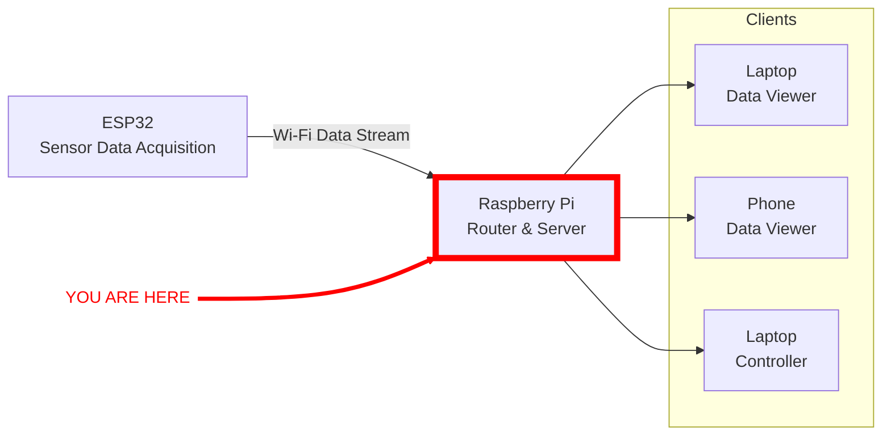

# prop-teststand

This project is built to be the interface server for controlling the QRET propulsion sub team's static hot fire setup.

## IDE Setup

This project is intended to be opened in VSCode. When you first open the project, install the recommended extensions that pop up in the bottom right.

## Environment Setup

To run this project you should be running Python3.11.x, with an isolated virtual environment. See [python docs](https://docs.python.org/3/library/venv.html) for help setting up a virtual environment.

To install all the required packages to work as a developer on this code, run: `pip install -e .`, or if you are using
uv (which I highly recommend), `uv pip install -e .` in the `/prop-teststand` directory in the command line. This
installs all the listed requirements in the pyproject.toml file.

## System Architecture

This part of the test-stand network is intended to run on a Raspberry Pi (or equivalent) and act as a headless server
that intakes data and can forward it to any connected clients. In the absence of a Pi, the system can run on any linux
capable machine (or in WSL) and serve the same purpose. All of the data collection will be happening on the ESP32 side,
this server should act simply as a router for any clients that wish to connect to the datastream coming from the ESP32.

## ESP32 Setup

For more information on how to set up the microcontroller side of this project, see [its github project](https://github.com/Queens-Rocket-Engineering-Team/prop-esp32-logger).
