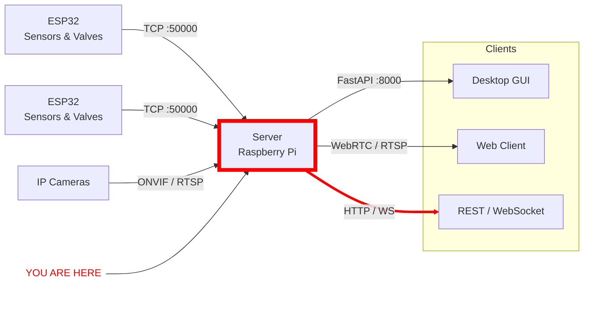

# prop-teststand

Server application for QRET's propulsion test stand. Discovers and communicates with ESP32 sensor/control devices over a custom binary TCP protocol, collects sensor data, controls valves, manages IP cameras, and exposes everything through a REST API and CLI.

## System Architecture

The server is designed to run on a Raspberry Pi (or any Linux machine / WSL) as a headless hub between ESP32 devices and any number of clients.



### Services

| Service | Description |
|---------|-------------|
| **server** | Main application — device discovery (SSDP), TCP listener, FastAPI, CLI |
| **redis** | Logging pub/sub and real-time data relay |
| **media** | [MediaMTX](https://github.com/bluenviron/mediamtx) RTSP/WebRTC relay for camera streams |
| **logs** | Log aggregator that reads from Redis channels |

## Setup

### Prerequisites

- [Docker](https://docs.docker.com/get-docker/) (recommended)
- Or: Python 3.11+ with [uv](https://docs.astral.sh/uv/)

### Development (Docker)

```bash
docker compose -f compose.dev.yml up
```

This starts all services with file watching — code changes in `libqretprop/` and `config.yaml` trigger automatic restarts.

### Production (Docker)

```bash
docker compose -f compose.prod.yml up -d
```

Pulls pre-built images from `ghcr.io/queens-rocket-engineering-team/`.

### Local (No Docker)

```bash
uv pip install -e .          # core dependencies
uv pip install -e ".[gui]"   # optional: GUI tools (PySide6)

start_server                 # start the server
```

Redis must be running separately for logging to work.

## Configuration

The server reads `config.yaml` for service connections and camera definitions:

```yaml
accounts:
  redis:
    username: server
    password: ...
  camera:
    username: propcam
    password: ...

services:
  redis:
    ip: localhost
    port: 6379
  mediamtx:
    ip: localhost
    api_port: 9997
    webrtc_port: 8889

cameras:
  - ip: 192.168.1.5
    onvif_port: 2020
```

Override the path with the `PROP_CONFIG` environment variable (defaults to `./config.yaml`).

ESP32 devices configure themselves — each device sends a JSON CONFIG packet on connection describing its sensors and controls.

## CLI Tools

| Command | Description |
|---------|-------------|
| `start_server` | Start the main server |
| `see_logs` | View real-time logs from Redis (`-e` errors, `-d` debug, `-s` system) |
| `mock_device` | Simulate an ESP32 device for testing |
| `full_gui` | Full PySide6 control panel (requires `gui` extra) |

Once the server is running, an interactive CLI provides commands like `discover`, `list`, `stream <device> <Hz>`, `control <device> <name> <state>`, and `estop`.

## Protocol

Devices communicate using a custom binary protocol over TCP (port 50000). All packets share a 9-byte big-endian header:

```
Offset  Size  Type    Field      Description
0       1     uint8   VERSION    Protocol version (0x02)
1       1     uint8   TYPE       Packet type
2       1     uint8   SEQUENCE   Wrapping 0-255 counter
3       2     uint16  LENGTH     Total packet size including header
5       4     uint32  TIMESTAMP  Milliseconds since boot/session
```

Devices are discovered via SSDP multicast on `239.255.255.250:1900`. On discovery, the device opens a TCP connection to the server and sends its CONFIG. The server then time-syncs the device and normal operation begins (streaming, control commands, heartbeats).

See [PROTOCOL_WALKTHROUGH.md](PROTOCOL_WALKTHROUGH.md) for the full wire-format specification.

## ESP32 Setup

For the microcontroller side of this project, see [prop-esp32-logger](https://github.com/Queens-Rocket-Engineering-Team/prop-esp32-logger).

## IDE Setup

This project is intended to be opened in VSCode. Install the recommended extensions when prompted.
