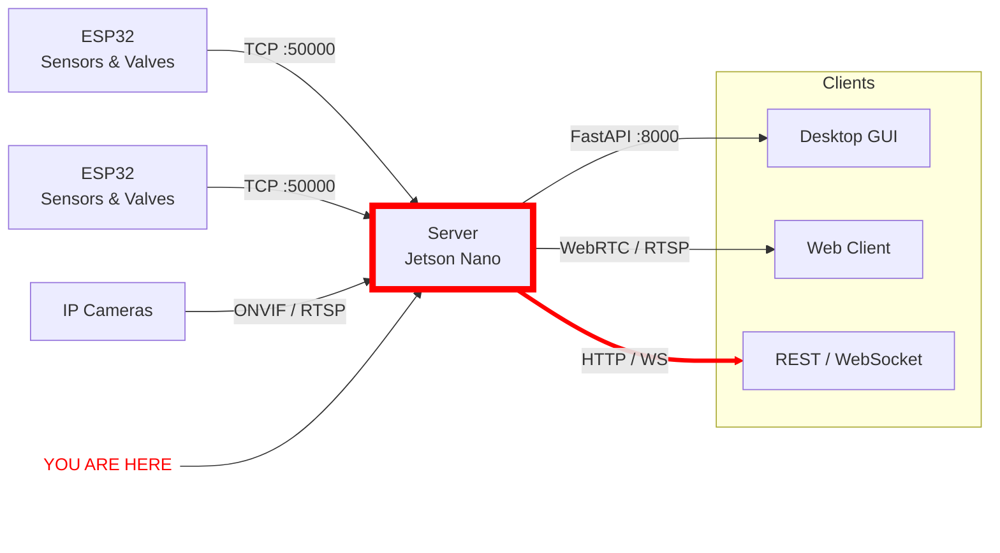

# prop-teststand

Server application for QRET's propulsion test stand. Discovers and communicates with ESP32 sensor/control devices over a custom binary TCP protocol, collects sensor data, controls valves, manages IP cameras, and exposes everything through a REST API and CLI.

## System Architecture

The server is designed to run on any linux machine as a headless hub between ESP32 devices and any number of clients.


```mermaid
flowchart LR
    ESP1[ESP32<br>Sensors & Valves] -->|TCP :50000| Server
    ESP2[ESP32<br>Sensors & Valves] -->|TCP :50000| Server
    Cam[IP Cameras] -->|ONVIF / RTSP| Server

    Server[Server<br>Jetson Nano]

    subgraph Clients
      direction TB
      GUI[Desktop GUI]
      Web[Web Client]
      API[REST / WebSocket]
    end

    Server -->|FastAPI :8000| GUI
    Server -->|WebRTC / RTSP| Web
    Server -->|HTTP / WS| API

    Here((YOU ARE HERE)) --> Server:::youAreHere
    classDef youAreHere stroke:red, stroke-width:6px;
    linkStyle 5 stroke:red,stroke-width:4px
    style Here fill:transparent,stroke:none,color:red;
```

### Services

| Service | Description |
|---------|-------------|
| **server** | Main application — device discovery (SSDP), TCP listener, FastAPI, CLI, in-process log stream |
| **media** | [MediaMTX](https://github.com/bluenviron/mediamtx) RTSP/WebRTC relay for camera streams |

## Setup

### Prerequisites

- [Docker](https://docs.docker.com/get-docker/) (recommended)
- Or: Python 3.12+ with [uv](https://docs.astral.sh/uv/)
- Local non-Docker qlcp builds also require CMake and a C compiler

### Development (Docker)

```bash
docker compose -f compose.dev.yml up
```

This starts all necessary services with file watching — code changes in `libqretprop/` and `config.yaml` trigger automatic restarts.

Follow server logs with:

```bash
docker compose -f compose.dev.yml logs -f server
```

### Production (Docker)

```bash
docker compose -f compose.prod.yml up -d
```

Pulls pre-built images from `ghcr.io/queens-rocket-engineering-team/`.

### Local (No Docker)

```bash
uv sync
uv run start_server
```

`uv sync` installs the environment. The qlcp native library and CFFI protocol
extension are rebuilt automatically during package installation.
Run `uv sync` again to force a local protocol rebuild.

Run the mock device locally for testing with:

```bash
uv run mock_device
```

## Configuration

The server reads `config.yaml` for service connections and camera definitions:

```yaml
accounts:
  camera:
    username: propcam
    password: ...

services:
  mediamtx:
    ip: localhost
    api_port: 9997

cameras:
  - ip: 192.168.1.5
    onvif_port: 2020
```

Override the path with the `PROP_CONFIG` environment variable (defaults to `./config.yaml`).

ESP32 devices configure themselves — each device sends a JSON CONFIG packet on connection describing its sensors and controls.

## CLI Tools

| Command | Description |
|---------|-------------|
| `start_server` | Start the main server |
| `mock_device` | Simulate an ESP32 device for testing |

Once the server is running, an interactive CLI provides commands like `discover`, `list`, `stream <device> <Hz>`, `control <device> <name> <state>`, and `estop`.

## Protocol

Devices communicate using a custom binary protocol over TCP (port 50000) and UDP (port 50001). Devices are discovered via SSDP multicast on `239.255.255.250:1900`. On discovery, the device opens a TCP connection to the server and sends its CONFIG. The server then time-syncs the device and normal operation begins (streaming, control commands, heartbeats).

For more information on protocol specifications, see [ctl-qlcp-lib](https://github.com/Queens-Rocket-Engineering-Team/ctl-qlcp-lib).

## ESP32 Setup

For the microcontroller side of this project, see [ctl-node-firmware](https://github.com/Queens-Rocket-Engineering-Team/ctl-node-firmware).

## IDE Setup

This project is intended to be opened in VSCode. Install the recommended extensions when prompted.
