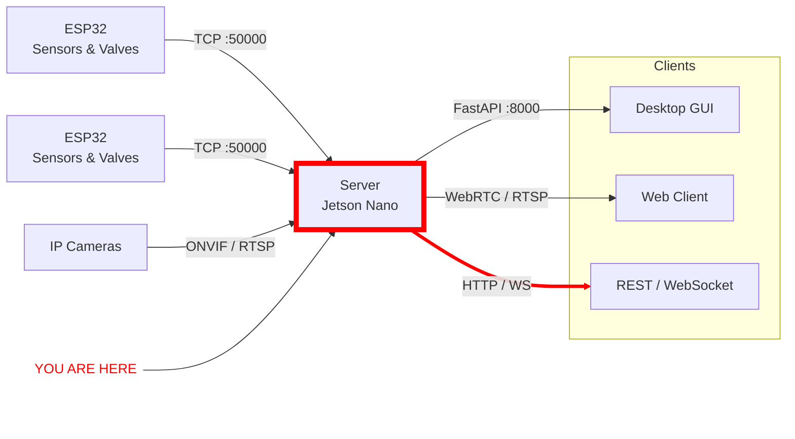

# prop-teststand

Server application for QRET's propulsion test stand. Discovers and communicates with ESP32 sensor/control devices over a custom binary TCP protocol, collects sensor data, controls valves, manages IP cameras, records a whole test as a single downloadable [session](#recording-sessions), and exposes everything through a REST API and CLI.

## System Architecture

The server is designed to run on any linux machine as a headless hub between ESP32 devices and any number of clients.


```mermaid
flowchart LR
    ESP1[ESP32<br>Sensors & Valves] -->|TCP :50000| Server
    ESP2[ESP32<br>Sensors & Valves] -->|TCP :50000| Server
    Cam[IP Cameras] -->|ONVIF / RTSP| Server

    Server[Server<br>Jetson Nano]

    subgraph Clients
      direction TB
      GUI[Desktop GUI]
      Web[Web Client]
      API[REST / WebSocket]
    end

    Server -->|FastAPI :8000| GUI
    Server -->|WebRTC / RTSP| Web
    Server -->|HTTP / WS| API

    Here((YOU ARE HERE)) --> Server:::youAreHere
    classDef youAreHere stroke:red, stroke-width:6px;
    linkStyle 5 stroke:red,stroke-width:4px
    style Here fill:transparent,stroke:none,color:red;
```

### Services

| Service | Description |
|---------|-------------|
| **server** | Main application — device discovery (SSDP), TCP listener, FastAPI, CLI, in-process log stream |
| **media** | [MediaMTX](https://github.com/bluenviron/mediamtx) RTSP/WebRTC relay for camera streams |

## Setup

### Prerequisites

- [Docker](https://docs.docker.com/get-docker/) (recommended)
- Or: Python 3.12+ with [uv](https://docs.astral.sh/uv/)
- Local non-Docker qlcp builds also require CMake and a C compiler

### Development (Docker)

```bash
docker compose -f compose.dev.yml up
```

This starts all necessary services with file watching — code changes in `src/` and `config.yaml` trigger automatic restarts.

The `recordings/` directory is shared between the server and MediaMTX. Both containers run as `${DOCKER_UID:-1000}:${DOCKER_GID:-1000}` so session directories stay owned by you; set those in `.env` if your uid is not 1000. If an older checkout left a root-owned `recordings/` behind, take it back once with:

```bash
sudo chown -R "$(id -u):$(id -g)" recordings
```

MediaMTX is pinned to `1.20.0`. **Do not move it below 1.15.1** — earlier versions destroyed and recreated a path when its `recordPath` was patched, which is exactly what starting a session does, and every live WebRTC viewer would be dropped. If viewers ever drop at session start, check the MediaMTX log for `path destroyed`.

Follow server logs with:

```bash
docker compose -f compose.dev.yml logs -f server
```

### Production (Docker)

```bash
docker compose -f compose.prod.yml up -d
```

Pulls pre-built images from `ghcr.io/queens-rocket-engineering-team/`.

### Local (No Docker)

```bash
uv sync
uv run -m prop_teststand
```

`uv sync` installs the environment. The qlcp native library and CFFI protocol
extension are rebuilt automatically during package installation.
Run `uv sync` again to force a local protocol rebuild.

Run the mock device locally for testing with:

```bash
uv run -m tests.mock_device
```

## Testing

The server uses [pytest](https://docs.pytest.org/) for unit testing. Tests are located in the `tests/` directory and can be run with:

```bash
uv run pytest
```

## Configuration

The server reads `config.yaml` for service connections and camera definitions:

```yaml
accounts:
  camera:
    username: propcam
    password: ...

services:
  recordings:
    root: ./recordings                    # the server's view of the recordings tree
    mediamtx_container_root: /recordings  # MediaMTX's view of the same tree
  mediamtx:
    ip: localhost
    api_port: 9997

cameras:
  - ip: 192.168.1.5
    onvif_port: 2020
```

Override the path with the `PROP_CONFIG` environment variable (defaults to `./config.yaml`).

`services.recordings` is a pair of views onto **one shared directory**: the server writes telemetry there, and MediaMTX writes video into it through its own bind mount. The two must agree — if `mediamtx_container_root` does not match the `media` service's volume in the compose file, MediaMTX will happily write video to a path nobody can read. The server logs the mapping at startup, and a session whose cameras all armed but produced no files records a `no_video_recorded` warning in its metadata.

ESP32 devices configure themselves — each device sends a JSON CONFIG packet on connection describing its sensors and controls.

## Running

| Command | Description |
|---------|-------------|
| `uv run -m prop_teststand` | Start the main server |
| `uv run -m tests.mock_device` | Simulate an ESP32 device for testing |
| `uv run -m tests.chimera_mock_device` | Simulate a GPS tracker looping a full flight (pad → 13 000 ft → drogue → main) |

Once the server is running, an interactive CLI provides commands like `discover`, `list`, `stream <device> <Hz>`, `control <device> <name> <state>`, `tare <sensor>`, and `estop`.

### Taring

Sensor zeroing is applied server-side so every connected GUI sees the same numbers. `POST /v1/tares` with a sensor name zeroes that sensor from the mean of its most recent raw readings; `DELETE /v1/tares?sensor_name=...` removes the offset. Tares are keyed by sensor **name** rather than by device, so an offset set before a flight handoff still applies once the flight device takes over the same sensor name. They are held in memory only and are cleared when the server restarts.

Readings on `/ws/telemetry/raw` carry both the tared `value` and the `tare` that was subtracted, so the untared reading is always recoverable as `value + tare`. The current offsets are also in the `/ws/state` snapshot under `tares`, with `tare.updated` / `tare.cleared` deltas as they change.

## Recording sessions

A test is recorded as a **session**: one directory holding the telemetry CSV, every camera's video, the Mumble audio, and a `session.json` describing the run. `POST /v1/sessions/start` with `{"name": "Hot Fire 3"}` arms everything at once; `POST /v1/sessions/stop` finishes every artifact and writes the final metadata.

```
recordings/
  2026-08-10_143005_hot-fire-3/
    session.json
    telemetry.csv
    audio/mumble_recording_1770745805.opus
    video/Cam1_192.168.1.5_20260810_143007_512000.mp4
```

| Endpoint | Description |
|----------|-------------|
| `POST /v1/sessions/start` | Start recording. `409` if one is already running |
| `POST /v1/sessions/stop` | Stop recording and finalize the session |
| `GET /v1/sessions` | List sessions, newest first, plus free disk space |
| `GET /v1/sessions/{id}` | A session's full metadata |
| `GET /v1/sessions/{id}/download` | The whole session as a streamed zip |
| `GET /v1/sessions/{id}/files/{path}` | One artifact, without downloading the archive |

Starting a session **only records** — it never changes device stream rates, so the GUI keeps owning `STREAM`/`STOP`. Only telemetry is mandatory: a camera that fails to arm or an unreachable Mumble server is recorded as a failed component under `components` in `session.json` and the session continues. The active session is also in the `/ws/state` snapshot under `session`, with `session.started` / `session.updated` / `session.stopped` deltas, so every connected GUI agrees on whether a test is recording.

Sessions are never pruned automatically. Watch `free_bytes` from `GET /v1/sessions`.

### Aligning the recordings

Video filenames come from MediaMTX's wall clock while telemetry timestamps are on the server's monotonic clock. Devices time-sync to that same monotonic clock, so `session.json`'s `clock` block converts either one:

```
wall_clock = started_unix + (device_timestamp - started_monotonic)
```

### telemetry.csv

```
device_timestamp,source,PT101 [PSI],TC101 [C],heater_HEATER1,relay_SAFE24,valve_AV101
236711.7952,MockDevice,20.5075,44.2267,50.5000,0,1
```

Blocks run sensors, then controls, then Kasa outlets, each sorted alphabetically. Control columns are prefixed with the group the device declares in its QLCP config. Boolean controls are written as a bit: `1` when a valve is `OPEN`, and `1` when anything else is `CLOSED` — inverted, because those relays are wired normally-closed so `CLOSED` is the energized state. Non-boolean controls carry their actual value. An empty sensor cell means that sensor was absent from that batch, which is distinct from a reading of zero. `session.json` restates all of this under `telemetry.semantics`.

## Protocol

Devices communicate using the QRET Launch Control Protocol (QLCP) over TCP (port 50000) and UDP (port 50001). Devices are discovered via multicast on `239.100.0.1:10000` using a QLCP discovery packet. On discovery, the device opens a TCP connection to the server and sends its CONFIG. The device then time-syncs to the server and normal operation begins (streaming, control commands, heartbeats).

For more information on protocol specifications, see [ctl-qlcp-lib](https://github.com/Queens-Rocket-Engineering-Team/ctl-qlcp-lib).

## ESP32 Setup

For the microcontroller side of this project, see [ctl-node-firmware](https://github.com/Queens-Rocket-Engineering-Team/ctl-node-firmware).

## IDE Setup

This project is intended to be opened in VSCode. Install the recommended extensions when prompted.
